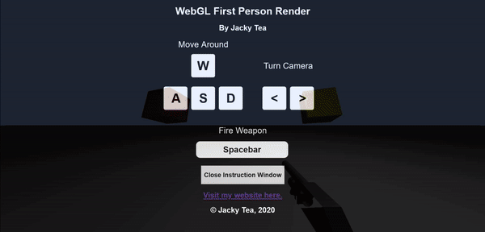

# WebGL First Person Demo

## Overview

A first person movement demonstration using WebGL 3D rendering.

## External Libraries and Tools Used

[Three.JS](https://threejs.org/) - a JavaScript library and API for 3D Graphics.

[Keeny.nl](https://kenney.nl/) - online asset market place for game models.

MTLLoader.JS - MTL Resource loader by [angelxuanchang](https://github.com/angelxuanchang).

OBJLoader.JS - OBJ Resource loader by [mrdoob](https://github.com/mrdoob).

**Credit is given where due for these tools.**

## Controls

| **Key**   |      **Movement**     |
|----------|:-------------:|
| W |  Walk forward. | 
| S |    Walk backward.   |  
| A | Strafe left.  |    
| D | Strafe right. |    
| Space Bar | Fire weapon. |    
| Left Arrow Key | Turn camera left. |   
| Right Arrow Key | Turn camera right. |   

## Demo GIFs

