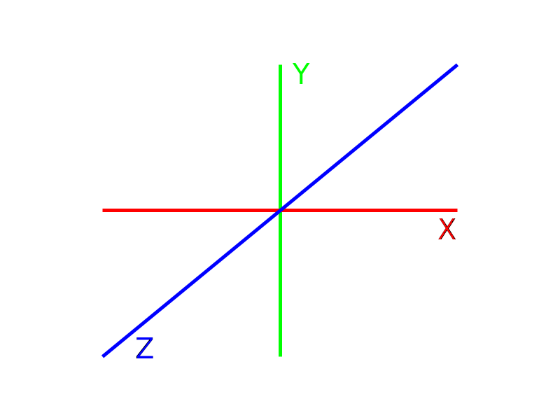
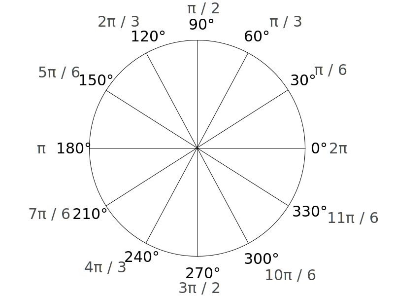

# WebGL First Person Render

## Overview

A first person movement demonstration using WebGL 3D rendering.

## External Libraries and Tools Used

[Three.JS](https://threejs.org/) - a JavaScript library and API for 3D Graphics.

[Keeny.nl](https://kenney.nl/) - online asset market place for game models.

MTLLoader.JS - MTL Resource loader by [angelxuanchang](https://github.com/angelxuanchang).

OBJLoader.JS - OBJ Resource loader by [mrdoob](https://github.com/mrdoob).

**Credit is given where due for these tools.**

## Techniques

All calculations were based off a 3D Cartesian plane denoted by the X-Axis (red line), Y-Axis (green line) and the Z-axis (blue line).

Radians were used to determine the degree of rotation.

**Locking The Camera**

Moving forwards ('w' key is being pressed):

*XcameraPosition = XcameraPosition - sin(YcameraRotation) - VmouseVelocity*

*ZcameraPosition = ZcameraPosition - (-cos(YcameraRotation)) - VmouseVelocity*

Moving backwards ('s' key is being pressed):

*XcameraPosition = XcameraPosition + sin(YcameraRotation) - VmouseVelocity*

*ZcameraPosition = ZcameraPosition - (-cos(YcameraRotation)) - VmouseVelocity*

Strafing left ('a' key is being pressed):

*XcameraPosition = XcameraPosition + sin(YcameraRotation + π / 2) - VmouseVelocity*

*ZcameraPosition = ZcameraPosition - (-cos(YcameraRotation + π / 2)) - VmouseVelocity*

Strafing right ('d' key is being pressed):

*XcameraPosition = XcameraPosition + sin(YcameraRotation - π / 2) - VmouseVelocity*

*ZcameraPosition = ZcameraPosition - (-cos(YcameraRotation - π / 2)) - VmouseVelocity*

Turning camera right ('right arrow ->' key is being pressed):

*YcameraRotation = YcameraRotation + VmouseVelocity*

Turning camera left ('left arrow <-' key is being pressed):

*YcameraRotation = YcameraRotation - VmouseVelocity*

**First Person Model Tracking**

Positioning:

*XcameraPosition = XcameraPosition - sin(YcameraRotation + π / 6) * C*

*YcameraPosition = YcameraPosition - C + sin(XcameraPosition + ZcameraPosition) * C*

*ZcameraPosition = ZcameraPosition - cos(YcameraRotation + π / 6) * C*

Rotation:

*XcameraRotation = XcameraRotation*

*YcameraRotation = YcameraRotation - π (ensures that the model faces the right way.)* 

*ZcameraRotation = ZcameraRotation*

**Projectile Calculations**

*VprojectileVelocityX = sin(YcameraRotation)*

*VprojectileVelocityY = 0*

*VprojectileVelocityZ = cos(YcameraRotation)*

## Controls

| **Key**         |    **Movement**    |
| --------------- | :----------------: |
| W               |   Walk forward.    |
| S               |   Walk backward.   |
| A               |    Strafe left.    |
| D               |   Strafe right.    |
| Space Bar       |    Fire weapon.    |
| Left Arrow Key  | Turn camera left.  |
| Right Arrow Key | Turn camera right. |

## Demo GIFs

